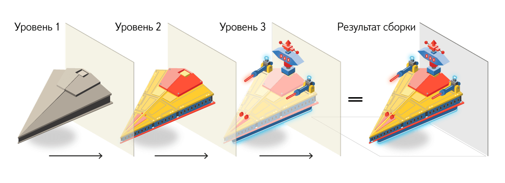

14 апреля я побывал в Екатеринбурге на конференции DUMP 2017. Больше всего мне понравился доклад [Владимира Гриненко](https://twitter.com/tadatuta) об управлении зависимостями в компонентном вебе, так что я вкратце перескажу здесь его суть.

Компонентный подход довольно распространён. Бутстрап, БЭМ, Реакт — всё это про компоненты, из которых строится интерфейс. Компоненты обычно состоят из скриптов и стилей. Если мы хотим использовать какой-либо компонент, нам нужно импортировать его логику и стили:

```javascript
/* application.js */
import Button from '../../ui/button.js';
import Link from '../../ui/link.js';
```

```css
/* application.css */
@import '../../ui/button.css';
@import '../../ui/link.css';
```

Недостатки такого подхода:

- многословность;
- на каждую технологию (скрипты, стили, etc) нужно писать свои импорты;
- пути к файлам захардкожены, меняется путь — нужно переписывать импорты.

При таком подходе мы делаем много ручной работы, которую за нас по-хорошему должен делать сборщик проекта. В идеале хотелось бы просто сообщать сборщику, какие компоненты мы будем использовать, чтобы он сам находил и подключал их файлы.

Владимир предлагает более простой и декларативный подход, избавляющий нас от вышеперечисленных проблем и дающий дополнительные преимущества. Этот подход — декларация зависимостей в терминах компонентов, а не в терминах конкретных файлов с реализацией. Избавляемся от всего лишнего, оставляем суть:

```javascript
/* было, application.js */
import Button from '../../ui/button.js';
import Link from '../../ui/link.js';

/* было, application.css */
@import "../../ui/button.css";
@import "../../ui/link.css";

/* стало, application.decl.js */
['button', 'link']
```

Теперь нам не нужно указывать, где конкретно находятся файлы зависимостей, и не нужно импортировать файлы для каждой технологии. Мы просто указываем, какие компоненты хотим использовать, а сборщик уже сам ищет и подключает нужные файлы.

## Алгебра деклараций

Декларации зависимостей можно легко объединять, вычитать и находить их пересечение. Например, это может быть полезно для выноса общих зависимостей в один файл:

```javascript
/* login.js */
['header', 'input', 'checkbox', 'button', 'footer'][
  /* landing.js */
  ('header', 'slider', 'gallery', 'button', 'footer')
][
  /* пересечение, которое можно вынести в common.js */
  ('header', 'button', 'footer')
];
```

## Композиция

Зависимости между компонентами тоже можно объявлять в виде деклараций. Было:

```javascript
/* header.js */
import Button from '../../ui/button.js';
import Link from '../../ui/link.js';
// ...

export default class Header {}
```

```css
/* header.css */
@import '../../ui/button.css';
@import '../../ui/link.css';
```

Стало:

```javascript
/* header.deps.js */
['button', 'link' /*, ... */];

/* header.js */
export default class Header {}
```

## Декларативное множественное наследование

Здесь уже начинаются страшные и со стороны непонятные БЭМ-штуки, которые, тем не менее, оказываются очень полезными и удобными, если в них разобраться.

В БЭМе есть модификаторы, позволяющие применять декларативное множественное наследование для компонентов. Например, кнопка может быть представлена в разных вариациях: синяя, большая, задизейбленная, с иконкой. Кнопка может находиться одновременно во всех этих состояниях. Эти состояния в БЭМе выражаются через модификаторы. Каждая модификация блока хранится отдельно от основной реализации. Подход декларации зависимостей в терминах компонентов избавляет от необходимости импортирования нужных модификаций блока: сборщик сам может определить и подключить используемые модификации блока.

## Уровни переопределения

Ещё одна мощнейшая штука, которая есть в БЭМе — уровни переопределения. Наглядная демонстрация принципа:



Расписывать здесь суть уровней переопределения я не стану, ибо она уже описана в документации БЭМа. Приведу реальный случай, в котором уровни переопределения сильно облегчают жизнь.

Яндекс любит проверять разные продуктовые гипотезы и проводить эксперименты. Например, команда поиска может выдвинуть такую гипотезу: «пользователи станут чаще переходить по рекламным ссылкам, если рекламу показывать на красном фоне». Чтобы проверить эту гипотезу, нужно провести А/Б-тестирование, то есть одной половине пользователей показать рекламупо-старому, а другой половине показать рекламу на красном фоне. После этого нужно сравнить результаты и проверить, действительно ли во втором случае пользователи кликали чаще.

Скорее всего, вы бы решили эту задачу так: в коде, отвечающем за показ рекламного блока, добавили бы условие наподобие «если пользователь входит в такую-то группу, добавляем сюда красный фон». Проблема в том, что таких экспериментов может быть очень много, и при таком подходе весь ваш код будет состоять из сплошных условий, которые ещё и нужно не забывать удалять. Явно немасштабируемый подход.

Вместо написания очередного условия можно просто создать новый уровень переопределения, на котором будет добавляться красный фон. Каждый уровень переопределения хранится отдельно от основной реализации, благодаря этому при окончании эксперимента можно просто удалить файлы с уровнем эксперимента и не трогать исходники.

Возвращаясь к теме декларации зависимостей, в случае с уровнями переопределения мы опять же выигрываем:

```css
/* было */
@import 'common/button.css';
@import 'project/button.css';
@import 'experiment/button.css';
```

```javascript
/* стало */
['button'];
```

## А как это использовать?

Для Реакта есть [bem-react-core](https://github.com/bem/bem-react-core), для всего остального есть [bem-sdk](https://github.com/bem-sdk).
