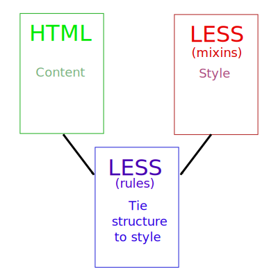

Среди разработчиков сейчас есть тенденция отказа от препроцессоров в пользу ванильного CSS. Давайте разберёмся, готова ли веб-платформа полностью заменить препроцессоры.

Начнём с того, что классические препроцессоры вроде Sass/Less/Stylus свой век почти отжили — им на смену пришли современные возможности CSS, а также PostCSS с большой [экосистемой плагинов](https://www.postcss.parts/). PostCSS по сути тоже препроцессор, только модульный — это главная причина его популярности и нужности. Подключаете и используете только нужные плагины, а если нужно что-то нестандартное, всегда можно написать свой плагин.

Окей, классические препроцессоры остались в прошлом, и теперь мы наедине с ванильным CSS и PostCSS. Большинство разработчиков на этом и останавливаются — мигрируют с классических препроцессоров на PostCSS, пишут стили в синтаксисе, максимально близком к нативному (и это хорошо, нечего плодить разные синтаксисы), а для поддержки недостающих возможностей подключают плагины.

В идеале хотелось бы избавиться от PostCSS и оставить только ванильный CSS (#usetheplatform). Как дела с ключевыми возможностями препроцессоров в веб-платформе?

**Математические выражения**. Поддерживаются нативно в виде функции `calc()` в CSS. Более того, `calc()` поддерживается подавляющим большинством браузеров — проблемы есть только в IE9-, Android Browser 4.3- и Opera Mini. Есть плагин [postcss-calc](https://github.com/postcss/postcss-calc), заранее вычисляющий на этапе сборки всё, что можно.

**Переменные.** Реализованы в CSS в виде [кастомных свойств](https://developer.mozilla.org/en-US/docs/Web/CSS/--*), и имеют даже более мощную функциональность, чем в препроцессорах — они доступны в JS, а также могут менять свои значения динамически с помощью медиавыражений:

```css
:root {
  --base-font-size: 16px;
}

@media (min-width: 1280px) {
  :root {
    --base-font-size: 18px;
  }
}
```

Кастомные свойства не поддерживаются в IE 11- и в большинстве мобильных браузеров. Базовая функциональность кастомных свойств реализуется плагином [postcss-custom-properties](https://github.com/postcss/postcss-custom-properties) — он на этапе сборки вычисляет все значения переменных и подставляет их в места использования, на выходе получается обычный CSS-файл с захардкоженными значениями. Динамическое переопределение значений переменных в медиавыражениях плагином не поддерживается.

**Вложенность.** Есть [черновик](http://tabatkins.github.io/specs/css-nesting/) Таба Аткинса с предложением по добавлению вложенности в CSS, но о полноценной спецификации и поддержке браузерами задумываться, судя по всему, сильно рано. И, на мой взгляд, вложенность в CSS должна поддерживаться только для медиавыражений, чтобы не дублировать селекторы, то есть предыдущий пример я бы хотел написать так:

```css
:root {
  --base-font-size: 16px;

  @media (min-width: 1280px) {
    --base-font-size: 18px;
  }
}
```

Вложенность селекторов, на мой взгляд, не нужна, потому что она поощряет увеличение специфичности и затрудняет чтение кода.

**Примеси** (миксины). И здесь не обошлось без [черновика](https://tabatkins.github.io/specs/css-apply-rule/) Таба Аткинса. Его предложение заключалось в том, чтобы реиспользовать функциональность кастомных свойств и разрешить хранить в них не только значения, но и целые блок стилей, а затем применять эти блоки с помощью нового правила `@apply`:

```css
.popup {
  --heading-style: {
    font-weight: bold;
    text-transform: uppercase;
  }
}

.popup__title {
  @apply (--heading-style);
}
```

На первый взгляд круто, но в таком решении есть проблемы из-за смешения обычных переменных, используемых через `var()`, и блоков правил, используемых через `@apply()` — Таб Аткинс подробно [описал эти проблемы](https://www.xanthir.com/b4o00) и сразу же предложил новое решение на основе Shadow DOM — псевдоэлемент `::part()`. Из статьи с описанием проблем мне стало ясно, что у Таба изначально было немного другое видение предназначения примесей.

Таб заметил, что кастомные свойства не дают достаточно гибкости для стилизации веб-компонентов. В качестве примера рассмотрим попап — изолированный компонент, к внутренностям которого доступ мы не имеем. Кастомные свойства позволяют настроить внешний вид попапа, например задать цвет его подложки или размер заголовка. Ограничение в том, что внешний пользователь компонента не может доопределить или переопределить стили его частей — например, того же заголовка. Именно эту задачу Таб решил, предложив `@apply`, и, к счастью, пришёл к лучшему решению с `::part()`.

Вроде здорово, но есть проблема. Основная задача, которую решают примеси — не до- или переопределение стилей, а _абстракция_. Есть замечательная [статья](http://www.lispcast.com/css-abstraction-combination), объясняющая, что CSS — неэффективный язык, потому что в нём нет средств абстракции и комбинирования. Примеси в первую очередь полезны для абстрагирования стилей и комбинирования этих абстракций. Только примеси позволяют добиться настоящего [разделения разметки и стилей](http://www.lispcast.com/cascading-separation-abstraction):



В общем, так как Таба Аткинса унесло в другую степь, перспектива появления примесей в CSS пока что туманна.

## Итого

Из трёх ключевых возможностей (переменные, вложенность, примеси) в CSS реализована только одна — переменные, и то поддержка браузерами пока не позволяет их использовать.

В простых проектах можно начать использовать только нативные возможности CSS с postcss-плагинами, выступающими в роли полифилов на этапе сборки. Такой подход я попробовал на [одном из проектов](https://github.com/andrew--r/madewithlove-landing/). Нужно было сверстать небольшой лендинг. Все стили я написал в одном файле с использованием CSS-переменных, причём на время разработки даже не пришлось настраивать никакую сборку — было достаточно подключить в разметке исходный файл со стилями, Хром нативно поддерживает CSS-переменные. Сборка потребовалась только для вычисления переменных, простановки вендорных префиксов и минификации — это заняло всего [17 строчек кода](https://github.com/andrew--r/madewithlove-landing/blob/master/build.js).

В серьёзных проектах такой подход скорее всего покажет себя плохо. Отсутствие вложенности и примесей как средства абстракции сильно усложняет поддержку кода, поэтому эту нишу препроцессоры занимают прочно.
