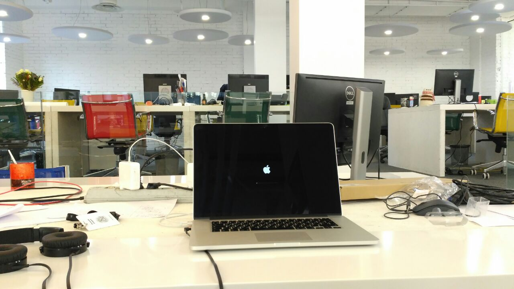
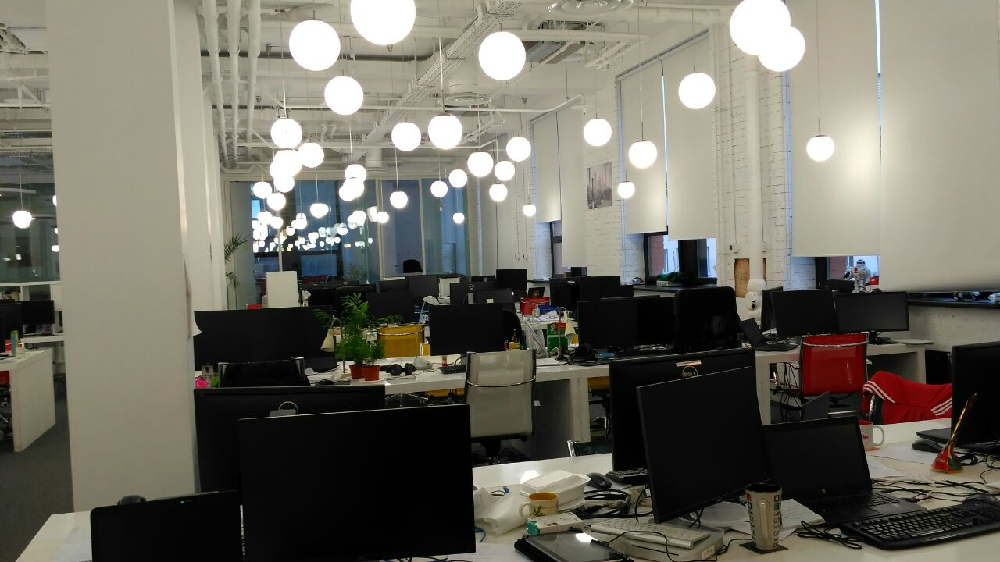

*Дисклеймер: Рамблер — большая компания, и описанный мной опыт относится только к конкретному отделу в конкретный период времени. С момента написания этой заметки многое изменилось в лучшую сторону.*

  
Так вышло, что с 10 октября по 23 ноября 2016 года я работал фронтенд-разработчиком в отделе рекламных технологий <a href="https://rambler-co.ru">Рамблера</a>.

  <aside class="sidenote__note">
    Впечатления от собеседования я описал в <a href="/notes/searching-for-job-2016">отдельной заметке</a>
  </aside>

Помимо меня в отделе было ещё семь фронтендеров: один джун, один тимлид и пять мидлов.

Я занимался поддержкой и развитием [«Лета»](https://leto.rambler-co.ru/), системы для размещения баннеров на площадках RAMBLER&Co. Система была написана на ПХП, Реакте и Редаксе, ну и писалась она в довольно сжатые сроки (впрочем, так бывает всегда).

## Про первый рабочий день

В первый рабочий день меня встретил местный эйчар, мы с ним получили бейджик-пропуск на ресепшене и отправились подписывать документы. Ознакомление со всеми нормативными актами, положениями и прочей бюрократией заняло около часа. После подписания всех бумажек мне выдали макбук и листок с конфиденциальными данными вроде паролей и ссылок (например, на местную соцсеть для сотрудников, в ленте которой можно было обнаружить объявления о продаже кроссовок).

После получения всего необходимого оборудования меня, наконец, проводили к рабочему месту и познакомили с тимлидом и командой, после чего начались трудовые будни в _хорошей компании™_.

## Про работу

Нормально развернуть проект не получилось. Ну, формально получилось, но на деле локально не грузилось большинство картинок, потому что картинки хранились не в какой-нибудь общедоступной CDN, а непонятно где. Зачем-то прямо в репозитории хранились билд-файлы и композеровские пакеты, и всё это ломалось на каждый чих. С фронтендом всё тоже было не в порядке. В проекте не было Автопрефиксера! А команда, которая писала проект, никогда раньше не работала с Реактом и Редаксом, что вылилось в огромные компоненты длиной более чем в тысячу строк, в дебрях которых напрямую изменялось состояние и делались другие страшные вещи, о которых я рассказывать не буду, иначе вы сегодня не заснёте. Тестов почти не было (ну, была парочка на весь проект).

Кодревью чаще всего ограничивалось комментариями «ты здесь забыл убрать `console.log()`». Сомневаюсь, что я писал настолько хороший код. В Иннове мой тимлид (спасибо, Антон) всегда оставлял комментарии не только про код, но и про решение в целом (архитектура, масштабируемость и все дела).

В целом от продукта оставалось неприятное ощущение — не только из-за кода, но и из-за дизайна и пользовательского опыта в целом. Орфографические и пунктуационные ошибки в интерфейсе были нормой. Чтобы их исправить, нужно было согласовывать обновлённый текст с менеджерами. Не было никакой стандартизации, кнопки были разных размеров, текст тоже, всё было хаотично разбросано по странице.

Дизайнер, как оказалось, в нашем отделе был один, а проектов в отделе было штук пять. И, как мне сказали, он не был способен к стандартизации, каждая страница у него получалась уникальная и неповторимая. Вследствие всего этого макеты для некоторых задач делали менеджеры, а не дизайнер.

Мой тимлид был чуть ли не единственным (кроме меня), кто понимал, что за задница здесь происходит. Он пытался постепенно менять всё в лучшую сторону, но он был один, а других сотрудников были десятки, и большинство из них были довольны текущим положением дел, поэтому всё двигалось довольно медленно и с болью. Он поддерживал меня во всех начинаниях, от рефакторинга до создания библиотеки компонентов, за что ему большое спасибо.

## Про увольнение

Проработав чуть больше месяца, я уволился — по большей части из-за того, что я не был готов фактически в одиночку брать на себя ответственность за весь проект и успевать пилить продуктовые и инфраструктурные задачи. Если не принимать во внимание другие факторы, увольнение было довольно глупым решением — я испугался ответственности и сразу сдался, а мог бы переделать проект по-человечески (наверное, до сих пор в этом не уверен). Но если принимать во внимание другие факторы (такие как, например, офер от Авито), я об увольнении не жалею.

Когда я сообщил о том, что собираюсь уходить, тимлид с техдиром долго уговаривали меня остаться и пытались понять, почему я ухожу. Я рассказал, что мне не понравилось и привёл в пример Яндекс и Авито, сказав, какие вещи там лучше. Кажется, я немного обидел техдира, когда он на вопрос «в Авито, по твоему мнению, специалисты опытнее наших?» получил ответ «да». Помимо прочего, мне предложили зарплату почти в полтора раза больше прежней, так что если вдруг захотите получать больше, сообщите начальнику, что собираетесь уволиться ;–).

## Про условия работы в целом

Компания согласилась оплатить мой перелёт из Омска в Москву, что довольно неплохо. Правда по условиям трудового договора я был обязан вернуть деньги за билет, если проработаю в компании меньше года. В итоге выделенную на билет сумму просто вычли из моей последней зарплаты, ибо год я не проработал. Но и тут без фейлов не обошлось. Через какое-то время после увольнения мне позвонили и сказали, что вычли 10 000 ₽ (столько выделили на перелёт), а билет стоил 9 500 ₽, и, мол, мне нужно приехать в офис Рамблера и заполнить какую-то бумажку, чтобы получить обратно разницу.

В компании есть собственная библиотека, но воспользоваться ей мне не довелось.

Для сотрудников есть куча всевозможных скидок, их список хранится в большом гуглодоке. На деле оказалось, что половина скидок неактуальна, а большинство из них и вовсе не превышают 10%.

Каждому разработчику выдают для работы макбук и внешний монитор.

«Кофе, чай, печеньки» — не ведитесь на это. Печеньки бывали только с утра и расходились они буквально за полчаса. Зато однажды печеньки были с логотипом компании! Что касается чая и кофе, на нашем этаже была кухня с двумя кофемашинами и двумя чайниками. Кофемашины периодически нужно было очищать от кофейной гущи, а ещё в них заканчивалась вода и нужно было самому доливать её туда из огромной бутыли, используемой обычно в кулерах. Здесь, конечно, можно сказать «да ты совсем зажрался», но я просто сравниваю с Яндексом или Авито, в них почему-то о таких вещах беспокоиться не приходится.

Где-то я слышал про бесплатные завтраки. Они оказались скидочной картой в соседнее кафе номиналом около 120 ₽ (точно не помню), на это можно было вроде как купить кашу и напиток. Эти карты были одноразовые, так что если вы желали завтракать каждый день, нужно было каждый день утром идти в другой корпус, чтобы получить карту.

Рабочее пространство — опенспейс без перегородок между рабочими местами. Просто столы в ряд и разработчики с обеих сторон.

Корпоративный английский был, но платить за него нужно было самому, а компания предоставляла определённую скидку. Ну и занятия велись в группах.

Митапы и конференции можно было посещать в счёт рабочего времени. Компания даже оплачивала билет на конференцию при обосновании необходимости посещения этой конференции.

## Результаты

За время работы я исправил n-ое количество багов, отрефакторил кучу кода, запилил несколько небольших продуктовых задач и заложил основу для библиотеки реиспользуемых UI-компонентов. Библиотека компонентов была самой интересной задачей, о ней я расскажу подробнее в отдельной заметке.
